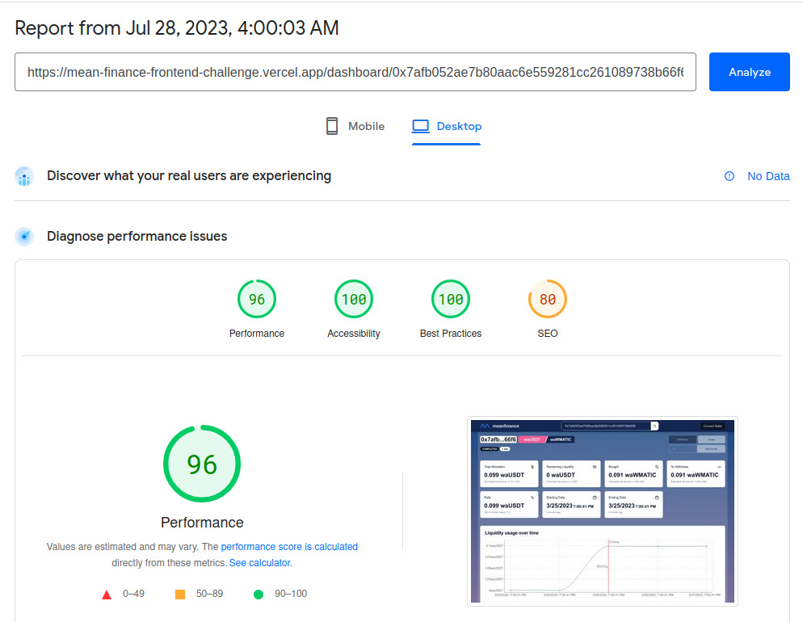
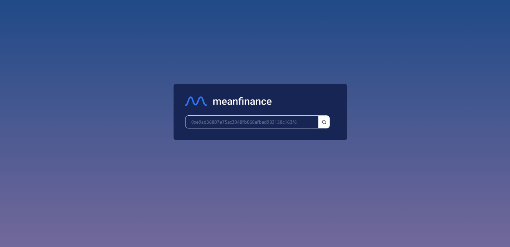
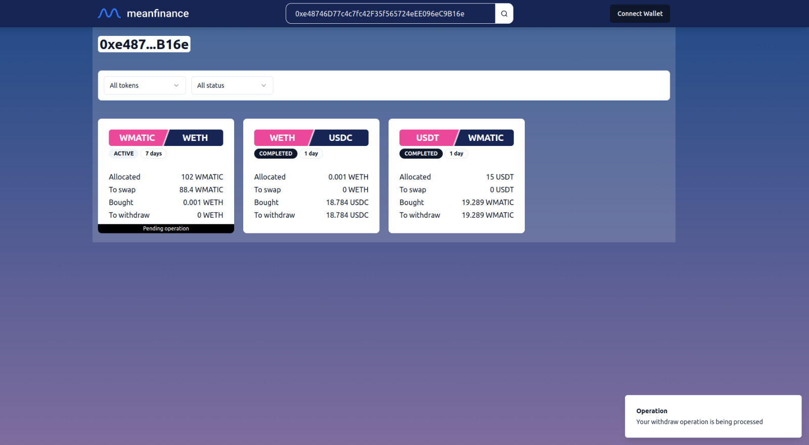
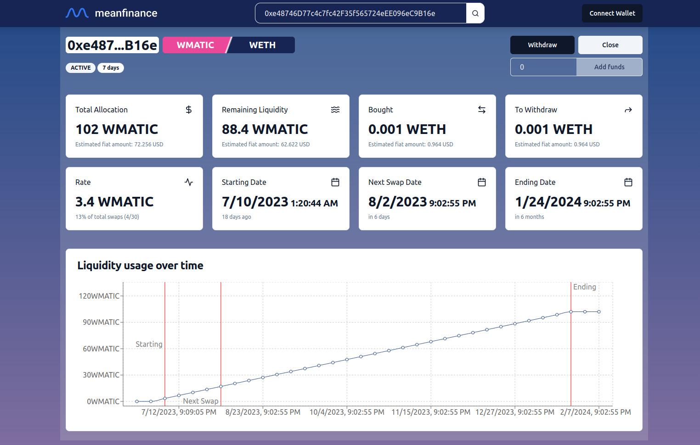

# Challenge solution

https://mean-finance-frontend-challenge.vercel.app/
## Comments on the challenge

1. Requested features were implemented
2. Actions on a position change the state on some other properties besides the requested ones. For example _closing_ a position sets the Remaining Liquidity to 0 since that effect could be expected in a real world application.
3. Exists at least one known error that can be triggered while using the application. This is commented in the project.
4. This implementation is far from being perfect. It attemps to show that I am able to use some frontend tools to create a proof of concept such as React, Tailwind, shadcn/ui. More features can be implemented in order to make this application useful such as Network Selection, User profile based on the connected account or Night/Light mode selection.
5. On what could be done differently:
   - SSR could improve the overall performance. NextJs could be considered.
   - Tests need to be added. Specially e2e using for example Cypress. Ideally these can be triggered on the creation of a new PR on GitHub using something like GitHub Actions.
   - Some refactoring could be useful.
6. No major changes were implemented on the services provided.

## Deployment and URLs

This implementation is deployed on Vercel: https://mean-finance-frontend-challenge.vercel.app/

* `/` and `/dashboard`: searcher (address) component view
* `/dashboard/{address}`: dashboard with the positions of the `{address}`
* `/dashboard/{address}/{positionId}`: dashboard with the details of the `{positionId}` for the `{address}`

## Lighthouse test

A [Lighthouse test](https://pagespeed.web.dev/analysis/https-mean-finance-frontend-challenge-vercel-app-dashboard-0x7afb052ae7b80aac6e559281cc261089738b66f6-2946/fb0e65n41e?form_factor=desktop) was run on PageSpeed Insights getting almost top score on all of the tested categories.


## Screenshots





## Some other related challenges I did
1. [Rather Labs (Solidity Developer)](https://github.com/garciagomezluis/ratherlabs-challenge)

# FE Challenge

## Before starting
This challenge aims to tackle problems very similar to what Mean's team does on a day to day basis. There are some terms related to cryptocurrencies, but no prior knowledge is needed to attempt the challenge. If you'd like to attempt this challege, please:
1. Clone this repository (but **make it private**)
2. Perform the tasks described below
3. Give access to [our account](https://github.com/MeanFinance) on your repository
3. Contact us at [hiring@mean.finance](mailto:hiring@mean.finance) with your repository's link and we'll follow up from there 🫡

We encourage you to tackle this challenge as you would normally work on other projects. Feel free to look up any information or algorithms that might help you achieve the defined goals.

Also, we would be more than happy to hear your feedback (good or bad) about the exercise to learn and make it better. Feel free to send all comments, suggestions and ideas to [hiring@mean.finance](mailto:hiring@mean.finance).

## Introduction

The idea of this exercise is to set up an SPA that gives information and allows to view and modify Mean Finance positions for a user and present a dashboard of the current status of a user investments.

Mean Finance is a decentralized platform that enables users to automate their DeFi (Decentralized Finance) strategies in a permissionless and flexible manner. It allows users to automatically execute recurring buy or sell orders on any Ethereum-based token in a decentralized way.

The key concept of Mean Finance is the "position". A position represents a series of recurring sell orders (DCA orders) for a particular asset. Once a position is created, the platform's smart contracts autonomously execute the specified orders at the defined intervals, requiring no further user intervention.

For example, a user might create a position to buy $50 worth of ETH every day, or sell 10 DAI every week, etc. This "set and forget" strategy automates the dollar-cost averaging (DCA) investment approach, which aims to reduce the impact of volatility on large purchases of financial assets.

Dollar Cost Averaging (DCA) is a strategy where you invest a fixed amount into an asset at regular intervals, aiming to reduce the impact of price volatility and potentially lowering the average cost per unit over time.

## What you need to do
Mean Finance current main product is one that allows to do DCA (Dollar Cost Average) between different tokens. Simply, it allows a user to set an order (or a `Position`) to sell an specified amount of tokens to buy another token in a set interval (every day, every week, etc) for a specific amount of time.

Let's go over an example to try to make things clearer. Let's say John has some DAI and he wants to buy WETH. If he wanted to buy 5 DAI worth of WETH daily, for a year, his position would look like this:
- **From**: DAI
- **To**: WETH
- **Rate**: 5 DAI
- **Amount of swaps**: 365
- **Swap interval**: daily

For the goal of this challenge we need you to create a React SPA that displays a dashboard/summary of a user's Mean Finance positions and a specific page for each position.

The dashboard/summary of a user's Mean Finance positions **must** include:
- A list of all the positions the user owns
- A summary of the amount of USD that a user has on Mean Finance
- Each position must have a link to view the position in a separate page.

The position detail page **must** include:
- The `rate`, `remainingLiquidity`, `toWithdraw`, on what interval the position is going to swap and a progress of how many swaps are remaining for each specific position.
- An action to "Withdraw" all the `toWithdraw` token
- An action to "Add Funds" that should only modify the `rate` of the position, maintaining the `remainingSwaps` of the position
- An action to "Close" the position, this will set the rate to `0` and also Withdraw all the `to` token of the position

The state of the positions should be shared between screens, this means that if a modification for a position was made on the Position detail page, the change should be reflected on the dashboard/summary.

To modify a position you will need to call the `modifyPosition` method of the Position Service, which as of now only waits some time to *simulate* an API call. You can modify this function as you'd like but do not remove the `timeout` function call, position modifications **need** to be persisted on the same user session, but it is ok if the modifications are lost on a browser refresh. Updates should be handled with the principle of **Optimistic UI**, which means that the updates should be applied to the UI as soon as the user submits an action and rollback them in case the underlying change on the API fails.

Each modification of a position can take a lot of time to process so, from `modifyPosition`, you will get a unique identifier that you can use to fetch the modification status to see if it is pending, if it was successful or if it failed

## What is already there?

There is already a minimal implementation of a React SPA project, built in Typescript.

There is also a PositionService already provided that allows:
 - fetching a specific user positions through [The Graph](https://thegraph.com/), which is a GraphQl api,
 - fetching the current price of a token
 - getting the current status of an ongoing modification.

Finally there is a util provided to format numbers with decimals represented with BigInts into their decimal format.

### BigInt Parsing
Tokens often need to represent amounts less than 1, like 0.5 or 0.001. However, the systems they're built on, like Ethereum, can't handle these small, fractional numbers directly.

So, they use a trick: instead of trying to deal with tiny fractions, they just deal with very large whole numbers, in our case we use Javascripts BigInt.

Imagine it like dealing with pennies instead of dollars. Instead of saying you have $1.23, you could say you have 123 pennies. That way, you can just deal with whole numbers and not worry about fractions.

Each token uses a custom amount of decimals. For the previous example, a USD token would look like this
```
{
  address: '0xusdDollarAddress',
  decimals: 2,
  name: 'United States Dollar',
  symbol: 'USD'
}
```

The exported function `formatBigInt` allows passing a BigInt value and a decimals value and it will format the BigInt value to a decimal representation. Based on the previous example for USD you would call it like this `formatBigInt(123n, 2)` and it will return `1.23`.

As for a Mean Finance position example you could do `formatBigInt(position.toWithdraw, position.to.decimals)` to get the decimal representation of the `toWithdraw` of a position of a user

### Position Service

#### fetchCurrentPositions

This method will allow fetching any existing user Mean Finance positions, for the challenge you can use the `0xe48746D77c4c7fc42F35f565724eEE096eC9B16e` user/address to fetch some positions.

A Mean Finance position allows a user to swap `rate` amount of `from` tokens and buy the corresponding amount of `to` tokens in a set interval (every hour, every day, every week, etc) that the user chooses for an amount of time that the user wants.

A Mean Finance position consist of the following data:

 - *From*: The token that the user wants **to sell**, it is represented by 4 attributes
    - `address`: A hexadecimal unique identifier for the specific token
    - `decimals`: The amount of decimals that this token uses for its amounts
    - `name`: The full name of the token
    - `symbol`: A shortened name for the token
 - *To*: The token that the user wants **to buy**, represented by the same 4 attributes as the `From` token
 - *User*: The user for which the Mean Finance position **belongs to**
 - *Swap Interval*: The set interval expressed **in seconds** that the user selected that the swaps for their position wanted to be executed in (for example, 3600 = 'Every hour')
 - *Remaining Swaps*: The amount of swaps **left** for the position to be completed
 - *Total Swaps*: The **total** amount of swaps that the user set this position to swap
 - *Rate*: The amount of `from` tokens that the position **will swap** every time
 - *Remaining Liquidity*: The amount of `from` tokens that have **not been swapped** yet
 - *To Withdraw*: The amount of `to` tokens that the positions **has already been swapped** and the user **can withdraw**
 - *Swaps*: A collection of all the swaps that Mean Finance has executed on the position, each item contains
    - `swapped`: The amount of `to` tokens that the user got on the swap,
    - `rate`: The amount of `from` tokens that were used on the swap
    - `timestamp`: The timestamp of when the swap was executed, in seconds
 - *Status*: The status of the position it can be either one of two options
    - `ACTIVE`: The position still has pending swaps
    - `COMPLETED`: The position has no pending swaps

### modifyPosition
This method will submit the position modification to the API and return a unique identifier to poll for the modification status

### getPositionTransactionStatus
This method will return either 'PENDING', 'SUCCESS' or 'FAILURE' based on the transaction status of a specific position modification id (returned by `modifyPosition`)

### getUsdPrice
This method receives an array of Token addresses and returns the USD price for each one as a `Record<tokenAddress, usdPrice>`. It optionally accepts a `date` as a UNIX timestamp to fetch the price for a specific point in time.
